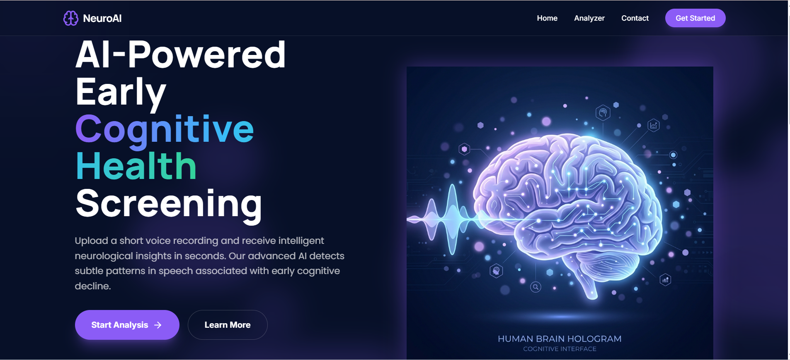
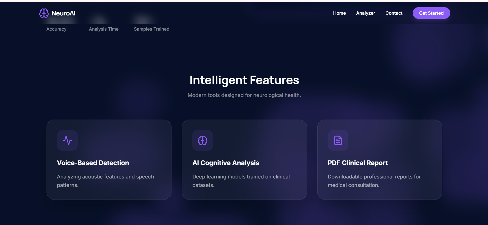
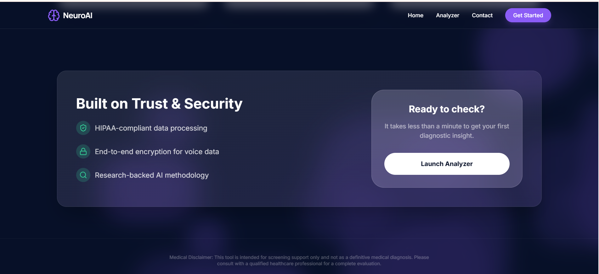
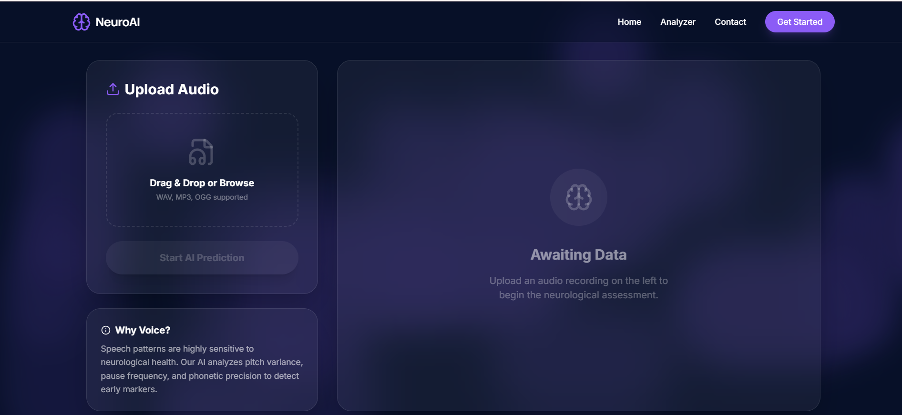
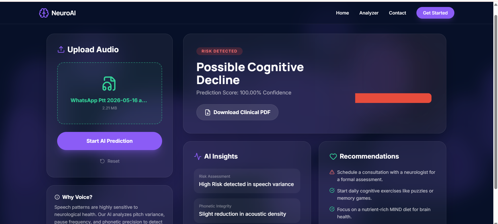
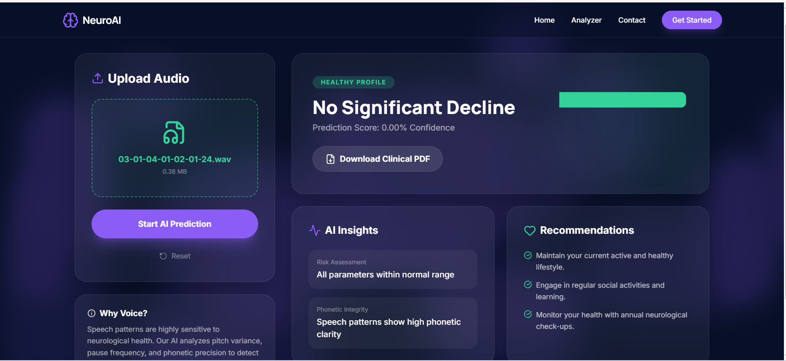

# 🧠 NeuroAI — Early Cognitive Decline Detection via Voice


An AI-powered full-stack web application that detects early cognitive decline patterns from human speech using Deep Learning and NeuroAI techniques. Built with a **React + Vite** frontend and a **Flask** backend.

> ⚠️ **Disclaimer:** This application is not a medical diagnostic tool. Predictions are AI-generated estimates and must not replace professional medical advice.

---

## � Application Screenshots

### 🏠 Home Page

The home page provides an attractive landing interface where users can upload medical images and access the pneumonia analysis system.





---

### 🔬 Analyzer Page

The analyzer page allows users to upload chest X-ray images, run the AI model, and view detailed prediction results with confidence scores.





---

## 📄 Beautiful PDF Report Download

Download a polished, AI-generated PDF report summarizing the analysis, predictions, and confidence levels for easy sharing with healthcare providers.

---

## �🚀 Project Overview

Early symptoms of cognitive decline and Alzheimer's disease often manifest in speech:

- Unusual pauses and hesitation
- Reduced verbal fluency
- Irregular pitch variation
- Repetitive speech patterns

This project analyzes uploaded voice recordings and predicts possible early cognitive decline using a trained Deep Learning model that extracts MFCC audio features and passes them through a neural network with attention mechanisms.

---

## ✨ Features

- 🎤 Upload voice recordings (WAV, MP3, OGG, M4A) via a modern React UI
- 🧠 Deep Learning–based prediction with confidence scoring
- 📊 MFCC audio feature extraction via Librosa
- 📈 Probability distribution bar chart on the Dashboard
- 📄 Downloadable Clinical PDF report with embedded AI diagnostic chart
- ⚡ Real-time prediction via Flask REST API
- 🌐 Multi-page React app (Landing, Dashboard, Contact)

---

## 📂 Project Structure

```
NeuroAI Problem/
│
├── frontend/                          # React + Vite frontend
│   ├── dist/                          # Production build output
│   ├── node_modules/                  # Node dependencies
│   ├── public/                        # Static public assets
│   ├── src/
│   │   ├── assets/                    # Images, icons, fonts
│   │   ├── components/                # Reusable React components
│   │   ├── pages/
│   │   │   ├── App.css                # Global app styles
│   │   │   ├── App.jsx                # Root app component
│   │   │   ├── Contact.jsx            # Contact page
│   │   │   ├── Dashboard.jsx          # Main analysis dashboard (bar chart, PDF)
│   │   │   └── Landing.jsx            # Landing/home page
│   │   ├── index.css                  # Base styles
│   │   └── main.jsx                   # React entry point
│   ├── .gitignore
│   ├── eslint.config.js
│   ├── index.html
│   ├── package.json
│   ├── package-lock.json
│   ├── postcss.config.js
│   ├── tailwind.config.js
│   └── vite.config.js
│
├── scratch/                           # Dev/test scripts (not for production)
│   ├── test_import.py                 # Import validation tests
│   ├── test_model_load.py             # Model loading tests
│   └── advanced_neuroai.py            # Experimental NeuroAI research code
│
├── app.py                             # Flask backend — REST API & ML inference
├── advanced_neuroai_model.h5          # Trained Deep Learning model (Keras/TF)
├── requirements.txt                   # Python dependencies
└── README.md
```

---

## 🛠️ Technologies Used

### Backend
| Technology | Purpose |
|---|---|
| Python 3.10+ | Core language |
| Flask | REST API server |
| TensorFlow / Keras | Deep Learning model |
| Librosa | Audio feature extraction (MFCC) |
| NumPy | Numerical processing |
| ReportLab | Clinical PDF generation |

### Frontend
| Technology | Purpose |
|---|---|
| React 18 | UI framework |
| Vite | Build tool & dev server |
| Tailwind CSS | Utility-first styling |
| React Router | Multi-page navigation |
| Chart.js / Recharts | Probability bar chart visualization |

---

## ⚙️ Installation & Setup

### Prerequisites

- Python 3.10+
- Node.js 18+ and npm

---

### 1️⃣ Clone the Repository

```bash
git clone https://github.com/sadhukhanankita2025/Early-Cognitive-Decline-Detection-using-Machine-Learning.git
cd Neuro-AI-Detector
```

---

### 2️⃣ Backend Setup (Flask)

```bash
# Install Python dependencies
pip install -r requirements.txt
```

The `requirements.txt` includes:

```
# Web Framework
flask>=3.0.0
flask-cors>=4.0.0

# Deep Learning
tensorflow>=2.16.1

# Audio Processing
librosa>=0.10.0
soundfile>=0.12.1

# Numerical Computing
numpy==1.26.4

# PDF Report Generation
reportlab>=4.0.0

# Utilities
pandas>=2.0.0
```

---

### 3️⃣ Frontend Setup (React)

```bash
cd frontend
npm install
```

---

## ▶️ Running the Application

You need **two terminals** — one for the backend and one for the frontend.

### Terminal 1 — Start Flask Backend

```bash
# From the project root
python app.py
```

Flask will run at: `http://localhost:5000`

### Terminal 2 — Start React Frontend

```bash
cd frontend
npm run dev
```

Vite will run at: `http://localhost:5173`

---

## 🎤 How to Use

1. Open the web app at `http://localhost:5173`
2. Navigate to the **Dashboard** page
3. Upload a voice recording (`.wav`, `.mp3`, `.ogg`, `.m4a`)
4. Click **Analyze** — the AI model processes your audio
5. View the **prediction result** and the **probability bar chart** (Positive vs Negative)
6. Click **Download Clinical PDF** to export the full diagnostic report with the embedded chart

---

## 🧠 Model Information

The application uses `advanced_neuroai_model.h5`, a trained Keras Deep Learning model.

### Audio Features Extracted
- **MFCC** (Mel Frequency Cepstral Coefficients) — 40 coefficients
- Temporal voice characteristics
- Speech pattern cadence analysis

### Model Architecture
- Deep Neural Network (DNN)
- Attention Mechanism layer
- Sequential audio frame processing
- Binary classification output with confidence score

---

## 📊 Prediction Output

The system outputs one of two results, along with a confidence percentage:

| Result | Meaning |
|---|---|
| ✅ No Significant Cognitive Decline | Speech patterns are within normal range |
| ⚠️ Possible Early Cognitive Decline | Speech patterns suggest further evaluation |

The **Dashboard** displays a bar chart comparing Positive vs Negative probability scores, and this chart is also embedded in the downloadable **Clinical PDF report**.

---

## 📌 Supported Audio Formats

| Format | Extension |
|---|---|
| Waveform Audio | `.wav` |
| MPEG Audio | `.mp3` |
| Ogg Vorbis | `.ogg` |
| MPEG-4 Audio | `.m4a` |

---

## 🔮 Future Improvements

- 🔍 SHAP Explainable AI integration for prediction transparency
- 🎙️ Real-time microphone recording in-browser
- 🤖 Transformer-based speech analysis (Wav2Vec 2.0)
- 🖼️ Spectrogram visualization on the Dashboard
- 📉 Cognitive risk scoring dashboard with trend tracking
- 🔐 User authentication and result history

---
## 📜 License

This project is for **educational and research purposes only.**
